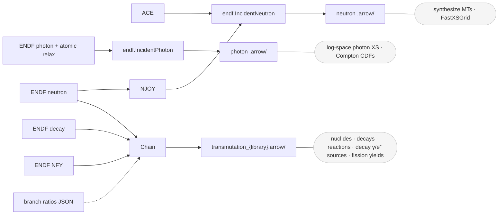

# Nuclear data to Arrow

**nuclear_data_to_arrow** converts nuclear data files (ACE or ENDF) into
simulation-ready [Apache Arrow IPC](https://arrow.apache.org/docs/format/Columnar.html#ipc-file-format)
directories (`.arrow/`).  The output is tailored for GPU-ready Monte Carlo
transport: columnar, fixed-width, zero-copy-mappable layouts that stream
directly into device buffers.  It includes pre-computed hierarchical MT
cross sections, FastXSGrid lookup tables, and log-space photon data -- everything YAMC needs to start a simulation with near-zero load time.

Transmutation and activation workflows are covered by a matching
`transmutation_{library}.arrow/` format: one directory of Arrow tables holding the
full transmutation network (decay data, decay-product sources, transmutation
reactions, and fission product yields).



## Quick start

```python
from nuclear_data_to_arrow import convert_neutron, convert_photon

# Neutron from ENDF (the default, runs NJOY internally)
convert_neutron(
    input_path="n-092_U_235.endf",
    output_dir="output/",
    library="endfb-8.0",
)

# Neutron from a pre-processed ACE table, when NJOY is unavailable
convert_neutron(input_path="92235.710nc", output_dir="output/",
                source_format="ace", library="endfb-8.0")

# Photon from ENDF
convert_photon(
    input_path="photoat-026_Fe_000.endf",
    output_dir="output/",
    atom_path="atom-026_Fe_000.endf",
    library="endfb-8.0",
)
```

## Output structure

### Neutron: `Fe56.arrow/`

```text
Fe56.arrow/
├── version.json          ← format version, library name, timestamps
├── nuclide.arrow         ← metadata, energy grids
├── reactions.arrow       ← all MTs incl. synthesized 1,3,4,27,101
├── products.arrow        ← reaction products
├── distributions.arrow   ← angle-energy distributions
├── fast_xs.arrow         ← FastXSGrid lookup tables per temperature
├── urr.arrow             (optional: unresolved resonance data)
├── total_nu.arrow        (optional: fission neutron yield)
└── fission_photon.arrow  (optional: fission photon energy release)
```

### Photon: `Fe.arrow/`

```text
Fe.arrow/
├── version.json
├── element.arrow         ← metadata, energy + ln(energy), XS + ln(XS)
├── subshells.arrow       ← photoionization per subshell with ln(XS)
├── compton.arrow         (optional: profiles + pre-computed CDFs)
└── bremsstrahlung.arrow  (optional)
```

### Transmutation network: `transmutation_{library}.arrow/`

```text
transmutation_endfb-8.1.arrow/
├── manifest.json         lists the subsections present + provenance
├── decay/                nuclides (name, half_life, decay_energy, + their
│                         uncertainties), decay modes, sources
├── reactions/            transmutation reaction topology + Q
├── fission_yields/       per fissioning parent (+ inheritance aliases)
└── branching/            (reserved for isomeric branch ratios; not emitted yet)
```

Each subsection is independently library-sourced and self-describing (its own
`provenance.json`), so a consumer can assemble a chain from a different library
per subsection.  See [format](format.md) for the full layout.

